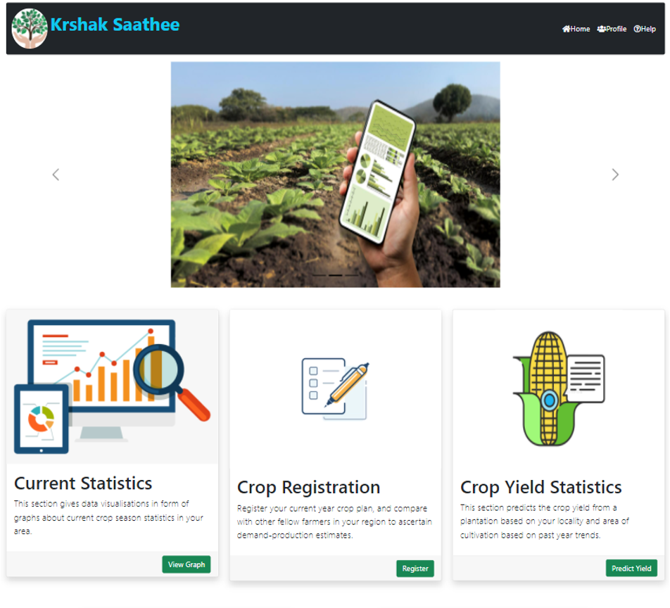
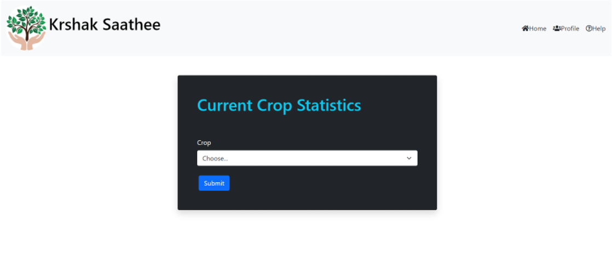
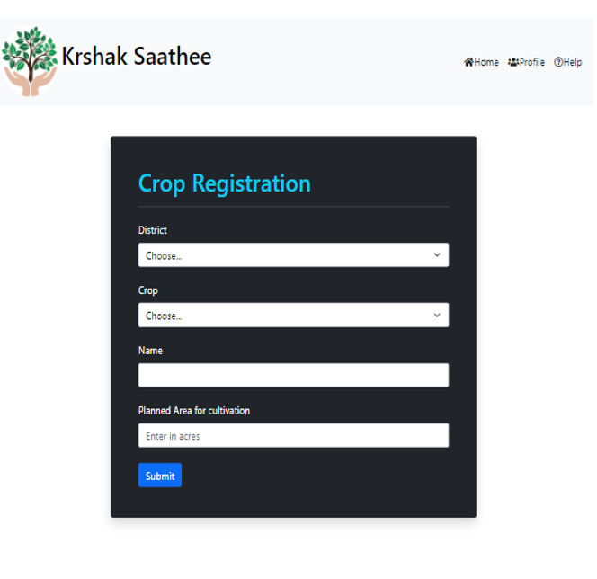
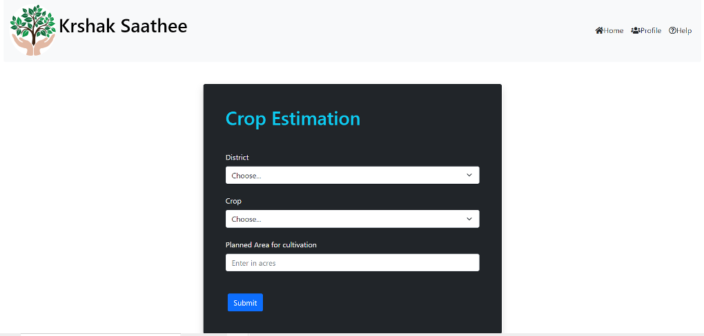
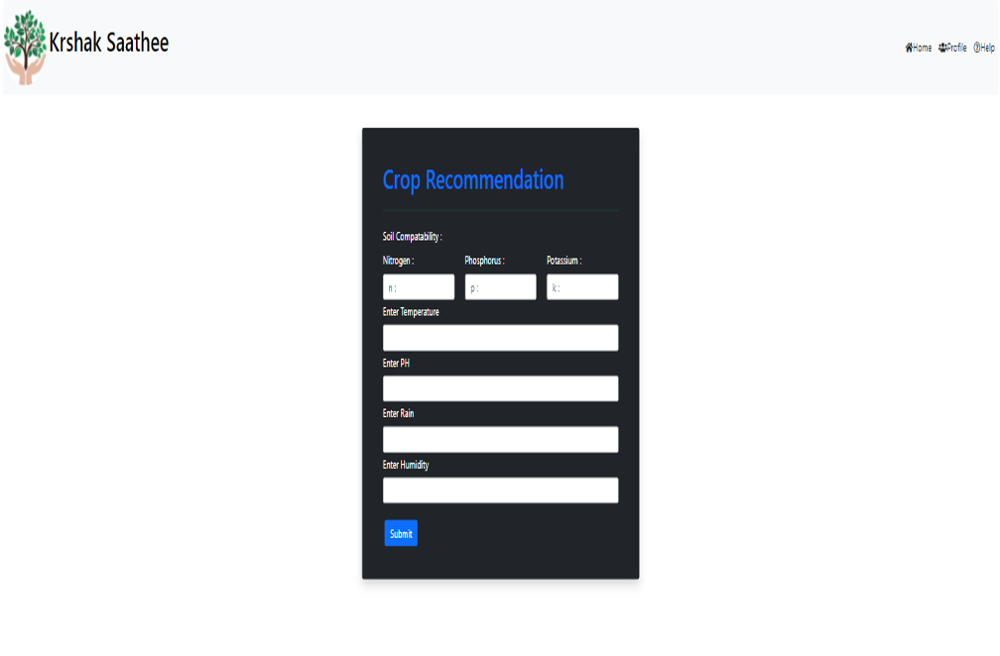
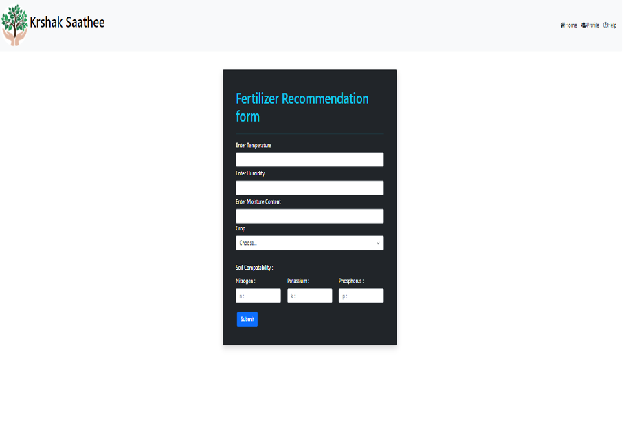

# Crop-Yield-Estimator

The platform provides farmers with information and tools to make informed decisions about their crops. It includes crop yield estimation, crop recommendation system based on soil factors, market information. The platform helps farmers to choose the best crop for their region, understand market prices and demand, and protect their investments.

Web app which commits to solve few problems faced by farmers and enhancing agriculture through Machine Learning.

## Tech Stack

 
           

# Problem Explanation

We grew up watching the scenarios like farmers were unable to get fair prices to their crops. 
This is due to the production of crop more than the demand. When farmers won't get good benefits from their earlier crops they switch the crop in next crop years. 
This causes a shortage of that crop in the upcoming years and prices for that crop will rise eventually. 

Due to the repeated occurence of such scenarios as described above, we could see sudden, huge rise and fall in the same crop price in consecutive years.
This is due to the **COMMUNICATION IMBALANCE** among the farmers and the government.

# Believed Solution

## Crop Statistics

Our Aim is to solve the problem of communication imbalance among farmers.
Our main aspect of this project is to create a real-time bar graph for crop yield.
With the data obtained from farmers registration on thier district, crop name and area of cultivation we calculate the crop yield.
With this data we plot a bar graph for that crop. We also plot a threshold line which is the demand or required production for that crop in the current year.
This enables the other farmers to make their decision to grow that crop or not accordingly.
So, the upcoming farmers can make a decision of growing the crop by comparing their calculated yield estimations and bar graph.
By this we are ensuring that production of crop is in a good relation with the demand of operational year.
This makes a communication balance between farmers to produce crops in accordance to demand and procure good benefits.

## Crop Yield Estimation

Crop Yield Estimation lets the user to know about the crop yield he could produce. This is a Machine Learning model (Mutli-Variable Regression) obtained by training District, Crop and Area of cultivation aganist the Crop Production. This section also predicts the price per quintal to be obtained by the farmer. The price Machine Learning model is obtained by training Crop, Area of cultivation and Crop Produdction (obtained from previous production model) aganist prices. This makes the farmer know the crop yield and price he can obtain for his crop.
Inputs:
  1. District
  2. Crop
  3. Area of cultivation

## Crop Registration

With the help of Crop Yield Estimation and comparing that to Current Crop Statistics farmer can make a decision on the crop that he has to grow. Crop statistics gives the details of the production of the crop in current year and demand so by predicting his production and price from crop yield estimation farmer can choose the crop he has to grow.
With that he has to register with that crop for that crop year. His registration takes the inputs like:
  1. District
  2. Crop
  3. Name of the farmer
  4. Area of cultivation

From this data we calculate his contribution in whole production (using previously built production ML Models) and add it to the bar plot. This helps in building a communication between farmers. And we hope this will make production to be in good relation with the demand.

# Other Features

## Crop Recommendation

Crop Recommendation system is developed using the Decision Trees. This is obtained by training data of factors like N, P, K values of soil, average rainfall of the locality, temperature, humidity and Ph of soil with various crops. Inputs taken from user are:
  1. N, P, K values of soil
  2. Average rainfall
  3. Temperature
  4. Humidity
  5. Ph of soil

## Fertilizer Recommendation

Fertilizer Recommendation system is developed using the Decision Trees. Fertilizer Recommendation is done for a particular crop. So, considering crop is a necessary parameter. This model is obtained by training data of factors like N, P, K values of soil, moisture, temperature, humidity and crop name with various fertilizers. Inputs taken from user are:
  1. N, P, K values of soil
  2. Moisture
  3. Temperature
  4. Humidity
  5. Crop Name

This concludes the whole project features that we have developed.

# Technical Details

## Various phases of the product

1. WEB INTERFACE (UI)
	- HTML 5
	- BOOTSTRAP 5
2. MACHINE LEARNING MODELS
	- MULTI-LINEAR REGRESSION or MULTI-VARIABLE LINEAR REGRESSION
	- DECISION TREE
3. FLASK

### Flask usage

Flask is the python framework. It is used for the web pages navigation, reading data from input fields of UI  and processing it. And also to integrate ML Models with the web pages.

## Modules of python used

- Numpy
- Pandas
- Sklearn (for ML Algorithms)
- Matplotlib (data visualization)
- Seaborn (heatmaps)
- Flask
- Pickle

# Development Platforms

- VSCode (for creating UI)
- Google Colab (for developing required ML Models)
- Jupyter (for developing required ML Models)
- Pycharm (to deploy final project and integration of ML Models with web)

# Images of Application

img src="./images/login.png">

